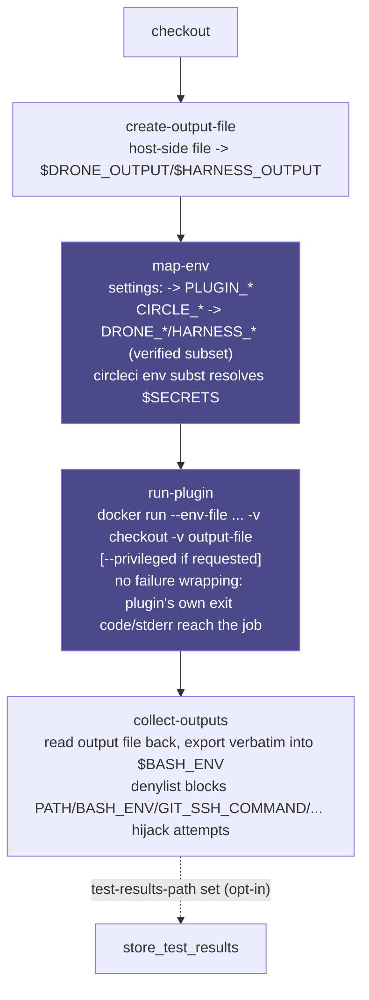

# Harness Orb (Unofficial) [](https://circleci.com/gh/CircleCI-Labs/harness-orb) [](https://circleci.com/developer/orbs/orb/cci-labs/harness) [](https://raw.githubusercontent.com/CircleCI-Labs/harness-orb/main/LICENSE) [](https://discuss.circleci.com/c/ecosystem/orbs)

The Harness Orb lets you run a single [Harness CI / Drone plugin](https://developer.harness.io/docs/continuous-integration/use-ci/use-drone-plugins/run-a-drone-plugin-in-ci/) - one of the ~180+ Docker-image "Plugin" steps in the Harness/Drone ecosystem - as a single step or job on CircleCI, with no Harness account, Drone runner, or `lite-engine`/`drone-runner-docker` involved. The plugin's settings become `PLUGIN_*` env vars exactly as Harness itself sets them, the plugin sees your checked-out code, and any output variables it writes come back into `$BASH_ENV` under their real vendor names so ordinary native CircleCI steps can read them.

---
**Disclaimer:**

CircleCI Labs, including this repo, is a collection of solutions developed by members of CircleCI's field engineering teams through our engagement with various customer needs.

-   ✅ Created by engineers @ CircleCI
-   ⚠️ **Not yet used by production CircleCI customers.** This orb is currently dev-published only. What *is* verified: a real, credential-free Drone/Harness plugin (`plugins/docker`, running privileged, doing a real nested Docker build) runs green in this repo's own CI -- see `test_plugin_docker_privileged_complex_target` in `.circleci/test-deploy.yml`.
-   ❌ **not** officially supported by CircleCI support

---

## Scope: one plugin per call, not a whole pipeline

This orb runs **one Harness/Drone Plugin step**, not a whole Harness pipeline or `.drone.yml`.
It is not a Harness-pipeline importer and doesn't touch Harness's own stage/pipeline
orchestration, approvals, or templates. Everything that would normally be a *separate* stage or
step in your old pipeline -- checkout, caching, artifact upload -- has a native CircleCI
equivalent already (`checkout`, `save_cache`/`restore_cache`, `store_artifacts`) and this orb
expects you to keep using those directly (see "Limits" below).

## How it works

A Harness/Drone plugin's entire execution contract is `docker run -e PLUGIN_X=Y image` - confirmed directly from Harness's own [local-plugin-testing instructions](https://developer.harness.io/docs/continuous-integration/use-ci/use-drone-plugins/custom_plugins/#test-plugins-locally). This orb reduces to exactly that, decomposed into four layered commands so a future multi-plugin chain could reuse pieces of it without a breaking change:

1. **`create-output-file`** - creates the host-side file that becomes the plugin's `$DRONE_OUTPUT`/`$HARNESS_OUTPUT`.
2. **`map-env`** - turns your `settings:` block into `PLUGIN_<KEY>` env vars (case rule verified against real plugin source, not assumed), maps the CIRCLE_\* vars that have a verified DRONE_\*/HARNESS_\* equivalent, and resolves `$VAR`/`${VAR}` references at runtime via [`circleci env subst`](https://circleci.com/changelog/new-cli-command-env-subst) so secrets never sit in orb config - substitution runs on each settings value only, after the block has already been split into individual `key: value` lines, so a substituted secret's value can never inject an extra settings line of its own.
3. **`run-plugin`** - the actual `docker run`, bind-mounting your checkout and the output file into the container. No failure wrapping, no retries: the plugin's own exit code and stderr reach the job unchanged - which also means a missing **plugin-specific** required setting (e.g. Slack's `webhook`) surfaces as whatever error the vendor's own binary happens to print, not an orb-level validation message. Consult the plugin's own README/Marketplace page for its required settings; this orb does not know them.
4. **`collect-outputs`** - reads the plugin's output file back and exports every value **verbatim**, under the plugin's own key, into `$BASH_ENV`.

The `plugin` command composes all four; the `plugin` job wraps that command with `checkout` and an executor.



Every stage is independently callable and cheap to rerun -- there's no CLI install step here at all (unlike the sibling `bitrise` orb), so chaining multiple plugins in one job (see "Chaining two plugins" below) needs no `skip-*` flags: just give each call its own `output-file`/`env-file` pair.

## Mapping your existing config

Here's a real Harness CI **Plugin step** -- Harness's own pipeline YAML, not Drone's --
next to this orb's equivalent:

```yaml
# Harness CI pipeline.yaml (Plugin step)
- step:
    type: Plugin
    name: Notify Slack
    identifier: notify_slack
    spec:
      connectorRef: account.harnessImage
      image: plugins/slack
      settings:
        webhook: <+secrets.getValue("slack_webhook")>
        channel: dev
```

```yaml
# .circleci/config.yml (this orb)
version: 2.1
orbs:
  harness: cci-labs/harness@x.y.z
workflows:
  notify:
    jobs:
      - harness/plugin:
          image: plugins/slack
          settings: |
            webhook: $SLACK_WEBHOOK
            channel: dev
```

What actually changed, concept by concept:

- **A Harness "Plugin step" becomes a `harness/plugin` command (inline, among native steps) or
  job (standalone).** `spec.image` maps straight onto this orb's `image` parameter, verbatim --
  no version resolution either side of the bridge.
- **`spec.settings` (a real nested YAML map) becomes this orb's flat `settings:` string**, one
  `key: value` per line -- see "Settings -> PLUGIN_*" above for exactly how each Harness type
  (scalar, boolean, list, nested map) flattens. Both sides ultimately produce the same
  `PLUGIN_<KEY>` env vars the plugin's own binary reads; Harness just hides that translation
  behind its UI/backend, while this orb makes it a parameter you write directly.
- **Where the vendor's secrets come from is the concept that changes the most.** Harness
  resolves `<+secrets.getValue("slack_webhook")>` against its own Secret Manager at pipeline-run
  time, inside Harness's SaaS control plane -- there is no equivalent backend here. Put the real
  value in a CircleCI **context** or **project environment variable** instead, and reference it
  as plain `$SLACK_WEBHOOK` inside `settings:`; `map-env` resolves it via `circleci env subst`
  before the plugin container ever starts, so the secret's value never enters your committed
  config, the same security property Harness's secret-reference syntax gives you.
- **`connectorRef`** is Harness's abstraction for *which credential set* to pull the image with
  (its own container registry connector). This orb has no equivalent -- it always does a plain,
  unauthenticated `docker pull`. If your plugin image is private, log in yourself first (a
  `pre-steps` `run: docker login ...`, or bake credentials into the executor) before
  `harness/plugin` runs; see "Limits" below.
- **What Harness's platform does for you that CircleCI does natively instead:** Harness's own
  stage-level artifact/test-report conventions have no fixed Plugin-step equivalent to begin
  with (see "Artifacts and test results" above) -- this orb deliberately doesn't default
  `store_artifacts`/`store_test_results` for the same reason Harness itself has nothing to point
  them at. If you know the specific plugin's own output path, wire your own `store_artifacts` /
  `store_test_results` step (or `post-steps:` on the `harness/plugin` job).

### Why `machine`, not `docker` + `setup_remote_docker`

Plugin containers need a real bind-mount of the checkout, and some need `--privileged`. With `setup_remote_docker`, the job's container and the Docker daemon it talks to are two separate machines - CircleCI's own docs are explicit that you can't bind-mount there, only `docker cp`. The `docker` executor and the self-hosted Container Runner also both refuse privileged containers outright. `machine` sidesteps all of it with a real bind mount and real root, at the cost of `docker` executor's per-second billing profile - exactly the tradeoff [`CircleCI-Labs/act-orb`](https://github.com/CircleCI-Labs/act-orb) already makes for the analogous GitHub Actions case.

**No vendor convenience-image executor here, deliberately.** Unlike the sibling `bitrise` orb (whose Steps run bare on the executor, with nothing else providing a toolchain), every Harness/Drone plugin **is already its own purpose-built image** - `run-plugin` just `docker run`s it directly. There is no generic Harness base image to adopt on top of that (Harness's own FAQ: "Harness doesn't provide custom Docker images for delegates"), and the `harness/default` executor's only job is to have a real Docker daemon and bind-mountable filesystem, which `machine` + `ubuntu-2404` already gives it. Checked against Harness's own docs and the Drone Community's published base images while researching this; there's genuinely nothing to add.

### Settings -> `PLUGIN_*`

`settings` is a plain multi-line string (orb parameters have no map type), one `key: value` per line:

```yaml
settings: |
  webhook: $SLACK_WEBHOOK
  channel: dev
  icon_url: https://unsplash.it/256/256/?random
  tags: latest,1.0.1,1.0
  with: {"path":"pom.xml","destination":"cie-demo-pipeline/github-action"}
```

becomes:

```
PLUGIN_WEBHOOK=<resolved value of $SLACK_WEBHOOK>
PLUGIN_CHANNEL=dev
PLUGIN_ICON_URL=https://unsplash.it/256/256/?random
PLUGIN_TAGS=latest,1.0.1,1.0
PLUGIN_WITH={"path":"pom.xml","destination":"cie-demo-pipeline/github-action"}
```

- **Scalars and kebab-case keys**: uppercased, `-`/`.` -> `_` (Harness's own docs: `PLUGIN_PATH` <- `path`, `PLUGIN_REPO_URL` <- `repo_url`; kebab-case is normalized the same way since env var names can't contain hyphens). A key that doesn't produce a legal env var name after this transform (e.g. one with a stray space) is rejected with an error naming the offending settings line, rather than silently writing a broken `--env-file`.
- **Booleans**: passed through as the literal string (`true`/`false`).
- **Lists**: written as a single comma-joined string, the same convention [Harness's own Drone-to-Harness migration guide](https://developer.harness.io/docs/continuous-integration/use-ci/use-drone-plugins/run-a-drone-plugin-in-ci/#convert-drone-yaml-to-harness-yaml) uses.
- **Nested maps**: written by you as a literal JSON string - that already *is* the wire format (Harness itself JSON-encodes `settings.with` into a single `PLUGIN_WITH` string; well-behaved plugins `json.Unmarshal` it, e.g. `plugins/github-actions`). This is the one place a Harness user has to hand-translate: Harness lets you write `with:` as genuine indented nested YAML, but this orb's `settings` is a flat string, so you flatten it into single-line JSON yourself. Get a quote or comma wrong and `map-env` rejects it immediately with the offending settings key and value (rather than letting a malformed string reach the plugin's own JSON-unmarshal call, which would fail with an opaque error deep inside the vendor's binary) - but only if `python3` is on the executor image; if it isn't, the string is passed through unvalidated.
- **Secrets**: reference `$MY_ENV_VAR` / `${MY_ENV_VAR}` - resolved at runtime against the job's real context/project env vars via `circleci env subst`, so the secret never appears in orb config.

### CIRCLE_\* -> DRONE_\*/HARNESS_\*

Only vars with a verified equivalent are mapped:

| CircleCI source | Drone/Harness var(s) set |
|---|---|
| `$CIRCLE_PROJECT_USERNAME` | `DRONE_REPO_OWNER` |
| `$CIRCLE_PROJECT_REPONAME` | `DRONE_REPO_NAME` |
| `$CIRCLE_PROJECT_USERNAME`/`$CIRCLE_PROJECT_REPONAME` | `DRONE_REPO` (`owner/name`) |
| `$CIRCLE_SHA1` | `DRONE_COMMIT` |
| `$CIRCLE_BRANCH` | `DRONE_COMMIT_BRANCH` |
| `$CIRCLE_BUILD_NUM` | `DRONE_BUILD_NUMBER` |
| container-workspace-path (parameter) | `DRONE_WORKSPACE`, `HARNESS_WORKSPACE` |
| container-output-file (parameter) | `DRONE_OUTPUT`, `HARNESS_OUTPUT`, `HARNESS_OUTPUT_FILE` |

Deliberately **not** shimmed, because no CircleCI equivalent exists without inventing one: `DRONE_BUILD_EVENT`, `DRONE_STAGE_STATUS`, `DRONE_BUILD_STATUS`, `DRONE_FAILED_STEPS`, `DRONE_COMMIT_AUTHOR*`, `HARNESS_ACCOUNT_ID`/`ORG_ID`/`PROJECT_ID`/`PIPELINE_ID`/`EXECUTION_ID`/`DELEGATE_ID`, `DRONE_NETRC_*`, `DRONE_SEMVER*`/`DRONE_CALVER`.

Two further gaps worth calling out explicitly, since this is the closest thing this README has to a "what doesn't work" section:

- **`HARNESS_OUTPUT_SECRET_FILE`** is not wired up. This is Harness's separate, newer, feature-flag-gated mechanism for output variables that Harness auto-masks as secrets in logs ([Output secrets](https://developer.harness.io/docs/continuous-integration/use-ci/use-drone-plugins/plugin-step-settings-reference/#output-secrets)). This orb only reads back `DRONE_OUTPUT`/`HARNESS_OUTPUT`; a plugin that writes secret-flagged output via `$HARNESS_OUTPUT_SECRET_FILE` has no equivalent here, and any value it does export the normal way lands in `$BASH_ENV` unmasked, same as everything else this orb exports verbatim.
- **Output variables are job-scoped here, not stage-scoped like Harness's.** Harness's own output-variable expressions work cross-stage (`<+stages.STAGE_ID...>`); this orb's mechanism (`$BASH_ENV`) only lives for the remainder of the current CircleCI **job**. A plugin's output can reach a later native step in the same job, but not a later CircleCI job in the same workflow.

#### Passing data across jobs anyway

CircleCI has two real, native mechanisms for this -- neither needs an orb change, and the right
one depends on what you're actually trying to do:

- **Passing a plugin's output value to a downstream job** (the common case): after
  `harness/plugin` runs, write the value you need to a file and `persist_to_workspace` it, then
  `attach_workspace` in the downstream job and read the file with a plain `run` step:

  ```yaml
  - harness/plugin:
      image: plugins/slack
      settings: |
        webhook: $SLACK_WEBHOOK
  - run:
      command: echo "$OUTPUT_VAR_NAME" > /tmp/workspace/plugin-output.txt
  - persist_to_workspace:
      root: /tmp/workspace
      paths: [plugin-output.txt]
  # -- downstream job --
  - attach_workspace:
      at: /tmp/workspace
  - run:
      command: OUTPUT_VAR_NAME="$(cat /tmp/workspace/plugin-output.txt)"; echo "$OUTPUT_VAR_NAME"
  ```

- **Branching which jobs run based on an upstream job's output** (the harder ask -- a genuine
  workflow-level conditional): CircleCI has no native construct for this at all. The closest
  real mechanism is a setup workflow plus the
  [`circleci/continuation`](https://circleci.com/developer/orbs/orb/circleci/continuation) orb,
  where an early job computes a value and calls `continuation/continue` with a config whose
  `workflows:` block is shaped by that value. There is no way to do this with `harness/plugin`
  output alone.

### Immutable pinning

`image` is passed through verbatim -- no version resolution of any kind. Any reference other
than a full digest pin can silently point at different image content later with no diff in
this repo to review: an omitted tag means `:latest` (the most mutable case), but even an
explicit version tag (`plugins/slack:1.4.1`) can be force-moved by the image's own maintainer.
`run-plugin` prints a one-line `WARNING` to the step's stderr whenever `image` doesn't contain
`@sha256:...`, mirroring the identical unpinned-`#ref` warning the sibling `buildkite` orb
already prints for a plugin reference with no ref pinned. To pin by digest, pull the image once
and read its digest back:

```shell
docker pull plugins/slack:1.4.1
docker inspect --format '{{.RepoDigests}}' plugins/slack:1.4.1
# => [plugins/slack@sha256:1a2b3c...]
```

then use that full `image@sha256:...` string as `image`. This is a warning, not an enforced
gate -- pinning is recommended, not required, since some plugins (and this orb's own examples)
are deliberately shown against a floating tag for readability.

### Docker-in-Docker and `--privileged` -- what it actually grants

`privileged: true` (see "A Docker-in-Docker plugin that needs `--privileged`" above) is not a
narrow "let Docker-in-Docker work" carve-out. Combined with the `machine` executor's real
host-device access, `--privileged` grants the plugin container `CAP_SYS_ADMIN`. From there, a
compromised or supply-chain-tampered plugin image can mount a host block device and read/write
the entire job VM's filesystem -- a full host-compromise primitive. Only set `privileged: true`
for a plugin image you trust, the same way you'd trust any other binary you run with root on
CI.

More generally: `run-plugin` always runs the plugin's Docker image with the job's full
environment available to it via `--env-file` and a bind-mounted checkout. Treat every plugin
image the same way you'd treat a third-party dependency you added to your build -- it is not
sandboxed against the job's secrets or filesystem beyond what a plain `docker run` container
boundary already gives you.

### Caching the plugin image

The `default` executor's `docker_layer_caching` parameter (off by default) enables CircleCI's
Docker Layer Caching for the `machine` executor's Docker daemon, so a repeated pull of the same
plugin image reuses previously-cached layers instead of pulling the full image again. **This is
an opt-in, billed feature, gated by your CircleCI plan** -- see
[CircleCI's Docker Layer Caching docs](https://circleci.com/docs/docker-layer-caching/) for
current plan eligibility and pricing. Rule of thumb for whether it's worth turning on: most
Harness/Drone plugin images (`plugins/slack`, `plugins/git`, and similar single-purpose plugins)
are in the tens of megabytes and pull in low single-digit seconds -- DLC's own fixed overhead
plausibly exceeds that, so leave it off. Larger plugin images (multi-hundred-MB to multi-GB --
Android/ML/browser-class images, or a plugin that itself layers a large base image) are where
DLC's layer-level reuse (a patch-version bump often only changes the top layer) starts to pay
off over a full `docker pull` every run. There's no separate `docker save`/`load` caching
mechanism in this orb on top of DLC -- it would be redundant with, and strictly worse than
(all-or-nothing per exact tag, vs. DLC's per-layer reuse), a feature that already ships.

### Workspace ownership

Plugin containers commonly run as root, so files they create in the bind-mounted workspace can be left root-owned on the host, breaking subsequent CircleCI steps. `run-plugin` reclaims ownership after every invocation - regardless of whether the plugin succeeded - trying `sudo chown` (what CircleCI's machine executor images document as available), then plain `chown`, then a throwaway container-based `chown` as a last resort, so the fix-up doesn't strictly depend on host sudo being configured.

### Artifacts and test results -- deliberately not auto-defaulted

Other orbs in the `cci-labs` ecosystem-bridge family default to running `store_artifacts`/
`store_test_results` for you against a vendor-documented directory, with zero config (this orb's
sibling `bitrise` orb, for example). This orb does **not**, on either axis, and that's a deliberate
per-vendor decision rather than an oversight -- there's no matching Harness convention to default
against:

- **No `store_artifacts` default.** Harness's only documented Plugin-step artifact hook is
  `PLUGIN_ARTIFACT_FILE` ([CI environment variables](https://developer.harness.io/docs/continuous-integration/ci-technical-reference/ci-env-var/#other-variables)) -- and that's a **link-manifest file**
  Harness's own hosted UI resolves into clickable links, not a directory of real artifact bytes.
  There is no Harness-documented fixed directory a Plugin step writes actual output files into (unlike
  Bitrise's `$BITRISE_DEPLOY_DIR`). Wiring `store_artifacts` at some invented directory here would
  either silently upload nothing or upload the wrong thing, which is worse than no default at all.
- **No `store_test_results` default.** Harness's JUnit-XML/`reports:` mechanism
  ([Report paths](https://developer.harness.io/docs/continuous-integration/use-ci/run-step-settings/#report-paths)) is a feature of **Run**/**Test** step types only -- the **Plugin** step type this orb
  wraps has no `reports:` field and no documented test-report convention at all. Plugin-step vendor
  images (Slack notify, Docker build/push, etc.) generally aren't test runners in the first place.

If you know the specific plugin you're running writes artifacts or test reports to a predictable path
inside the bind-mounted checkout, add your own `store_artifacts`/`store_test_results` step (or
`post-steps:` on the `harness/plugin` job) pointed at that path -- there's just no vendor-wide
convention this orb can default against safely.

## Quick start

For the most up to date examples, please visit the Orb Registry's [usage examples](https://circleci.com/developer/orbs/orb/cci-labs/harness#usage-examples). Three runnable ones:

### Run a plugin as a job

```yaml
version: 2.1
orbs:
  harness: cci-labs/harness@x.y.z
workflows:
  notify:
    jobs:
      - harness/plugin:
          image: plugins/slack
          settings: |
            webhook: $SLACK_WEBHOOK
            channel: dev
```

### Run a plugin inline, then read its output in a native step

```yaml
version: 2.1
orbs:
  harness: cci-labs/harness@x.y.z
jobs:
  build:
    machine:
      image: ubuntu-2404:current
    steps:
      - checkout
      - harness/plugin:
          image: plugins/slack
          settings: |
            webhook: $SLACK_WEBHOOK
            channel: dev
      - run:
          command: |
            echo "Plugin reported: $OUTPUT_VAR_NAME"
workflows:
  main:
    jobs:
      - build
```

### A Docker-in-Docker plugin that needs `--privileged`

```yaml
version: 2.1
orbs:
  harness: cci-labs/harness@x.y.z
workflows:
  main:
    jobs:
      - harness/plugin:
          image: plugins/github-actions
          privileged: true
          settings: |
            uses: actions/hello-world-javascript-action@v1.1
            with: {"who-to-greet":"Mona the Octocat"}
```

## Interleaving native CircleCI steps around the plugin

The `harness/plugin` **job** (only when invoked from a workflow's `jobs:` list, not the `plugin`
**command** inside another job's own `steps:`) accepts CircleCI's own built-in
`pre-steps`/`post-steps` arguments -- available on every 2.1+ job, not something this orb
declares. Pass them at the call site:

```yaml
- harness/plugin:
    image: plugins/slack
    settings: |
      webhook: $SLACK_WEBHOOK
      channel: dev
    pre-steps:
      - run: echo "before checkout AND before the plugin container"
    post-steps:
      - run: echo "after the plugin; its outputs are already in $BASH_ENV"
```

**One real platform caveat:** `pre-steps` run before **every** step in the job, including this
job's own internal `checkout` -- not just before the plugin. If a pre-step needs the repo
checked out first, either do that checkout yourself inside the pre-step, or use `checkout: false`
on the job plus an explicit `checkout` as the first entry of `pre-steps` so you control exactly
where it lands relative to your other pre-steps.

Need several native steps and several plugin invocations interleaved in a specific order within
one job? Reach for the `plugin` **command** (or the individual `create-output-file`/`map-env`/
`run-plugin`/`collect-outputs` commands) in a hand-rolled job instead -- see "Chaining two
plugins" in [`src/examples/chain_two_plugins.yml`](src/examples/chain_two_plugins.yml).

### Attaching a workspace before the plugin runs

`pre-steps` run before the job's own internal `checkout` (see the caveat just above), which
happens to be exactly the order a workspace attach needs: `attach_workspace` has to land before
`checkout`, or checkout risks clobbering files a prior job wrote into the same paths. That means
the correct CircleCI-native ordering already works today, with zero orb changes -- just put
`attach_workspace` in `pre-steps`:

```yaml
- harness/plugin:
    image: plugins/slack
    settings: |
      webhook: $SLACK_WEBHOOK
    pre-steps:
      - attach_workspace:
          at: .
```

## Limits

What genuinely doesn't work through this orb, gathered in one place (each is explained in more
depth where linked):

| Doesn't work | Why |
|---|---|
| **`HARNESS_OUTPUT_SECRET_FILE`** | Not wired up -- Harness's separate, feature-flag-gated auto-masked-output mechanism. A plugin using it has no equivalent here; see ["CIRCLE_* -> DRONE_*/HARNESS_*"](#circle_---drone_harness_) above. |
| **Output variables spanning more than one CircleCI job** | This orb's `$BASH_ENV` mechanism is job-scoped; Harness's own output-variable expressions are stage-scoped (cross-job). See "Passing data across jobs anyway" above for the real `persist_to_workspace`/`continuation`-orb workarounds. |
| **No `store_artifacts` default, and `store_test_results` is opt-in only** | No vendor-wide Plugin-step convention exists to default `store_artifacts` against at all -- see "Artifacts and test results" above. `store_test_results` has an explicit opt-in via the `test-results-path` parameter (empty by default -- nothing runs) once *you* know your specific plugin's own JUnit XML output path; there is still no *default* path, since none exists to default to. |
| **No built-in private-registry authentication** | Unlike this orb's sibling `bitbucket` orb (which has `registry-username`/`registry-password` parameters), `run-plugin` always does a plain, unauthenticated `docker pull`. For a private plugin image, `docker login` yourself first -- a `pre-steps` step on the `harness/plugin` job, or a step before `run-plugin`/`plugin` if you're composing commands directly. |
| **Harness's `connectorRef` / SaaS control plane** | No account, delegate, or `lite-engine` involved at all -- this orb only ever shells out to `docker run` locally. Anything that requires Harness's own backend (audit trails, approval gates, template library) has no equivalent. |
| **A Drone/Harness plugin with no public Docker image** | This orb only runs a plugin by its Docker image reference -- a plugin only ever distributed as a Harness-hosted "built-in" step with no separate pullable image can't be targeted. |

## Features

- Run any Harness/Drone Plugin-step Docker image as one step among native CircleCI steps, or as a standalone job.
- Real vendor `PLUGIN_*` settings, verified against Harness's own docs and real plugin source - not guessed.
- Plugin output variables land in `$BASH_ENV` under their own vendor names, so a native `run` step right after can just read them.
- `--privileged` support for Docker-in-Docker plugins (e.g. `plugins/github-actions`).
- Opt-in `store_test_results` via `test-results-path`, once you know your plugin's own JUnit XML output path.
- A one-line stderr warning when `image` isn't pinned by digest.

## Commands and job reference

| Name | Kind | What it does |
|---|---|---|
| `plugin` | command, job | The aggregate most users want: create-output-file -> map-env -> run-plugin -> collect-outputs, in order. |
| `create-output-file` | command | Creates the host-side file bind-mounted into the container as `$DRONE_OUTPUT`/`$HARNESS_OUTPUT`. **Truncates on every call** -- so when chaining, give each plugin its own `output-file` rather than reusing one path (see below). |
| `map-env` | command | Translates `settings:` into `PLUGIN_<KEY>` vars and the verified `CIRCLE_*` -> `DRONE_*`/`HARNESS_*` subset, writes a `docker --env-file`. |
| `run-plugin` | command | The `docker run` invocation itself, with bind mounts and (optionally) `--privileged`. |
| `collect-outputs` | command | Reads the output file back and exports every value verbatim into `$BASH_ENV`. |

**Reach for the granular commands instead of the `plugin` aggregate when:** you're chaining
multiple plugins in one job -- each layer reads/writes plain files and env vars with no shared
state to skip, so give each call its own `output-file`/`env-file` pair and call
`create-output-file` -> `map-env` -> `run-plugin` -> `collect-outputs` again (see
[`src/examples/chain_two_plugins.yml`](src/examples/chain_two_plugins.yml)), or when you want
native steps interleaved between individual stages (e.g. inspecting the derived `env-file` before
`run-plugin` executes).

### `plugin` (command and job) parameters

| Parameter | Type | Default | What it does |
|---|---|---|---|
| `executor` *(job only)* | executor | `default` | The executor to run the plugin container in -- must be `machine`. |
| `checkout` *(job only)* | boolean | `true` | Check out the project first. |
| `image` | string | *(required)* | The plugin's Docker image reference (e.g. `plugins/slack`, `plugins/slack:1.4.1`). |
| `settings` | string | `""` | Flat `key: value` block; each key becomes `PLUGIN_<KEY>`. `$VAR` resolved via `circleci env subst`. |
| `privileged` | boolean | `false` | Run the container with `--privileged` (Docker-in-Docker plugins). Requires `machine`. |
| `pull` | boolean | `true` | Run `docker pull` before `docker run`, refreshing mutable tags. |
| `workspace-path` | string | `.` | Host directory bind-mounted into the container as its workspace. |
| `container-workspace-path` | string | `/harness` | Container-side workspace path (`DRONE_WORKSPACE`/`HARNESS_WORKSPACE`). |
| `output-file` | string | `/tmp/harness-orb/output.env` | Host path capturing the plugin's output variables. |
| `container-output-file` | string | `/harness-orb-output.env` | Container-side output-file path (`DRONE_OUTPUT`/`HARNESS_OUTPUT`). |
| `env-file` | string | `/tmp/harness-orb/plugin.env` | Host path of the derived `docker --env-file`. |
| `additional-docker-flags` | string | `""` | Extra flags passed through to `docker run` verbatim. |
| `step-name` | string | `Run Harness plugin` | Name of the step that runs the plugin container -- override when chaining plugins so job-log steps are distinguishable. |
| `test-results-path` | string | `""` | Opt-in only. When set, runs `store_test_results` against this path after the plugin finishes. Left empty (the default), nothing runs -- there's no vendor-wide default path to fall back to. |

Individual commands (`create-output-file`, `map-env`, `run-plugin`, `collect-outputs`) expose the
matching subset of these parameters under the same names -- see each command's own description on
the [Orb Registry page](https://circleci.com/developer/orbs/orb/cci-labs/harness) for the
exhaustive, always-current list.

### Worked example: composing the granular commands by hand

```yaml
version: 2.1
orbs:
  harness: cci-labs/harness@x.y.z
jobs:
  notify:
    machine:
      image: ubuntu-2404:current
    steps:
      - checkout
      - harness/create-output-file
      - harness/map-env:
          settings: |
            webhook: $SLACK_WEBHOOK
            channel: dev
      - harness/run-plugin:
          image: plugins/slack
      - harness/collect-outputs
      - run: echo "plugin finished; anything it exported is already in \$BASH_ENV"
workflows:
  main:
    jobs:
      - notify
```

## Resources

[CircleCI Orb Registry Page](https://circleci.com/developer/orbs/orb/cci-labs/harness) - the official registry page of this orb for all versions, executors, commands, and jobs described.

[CircleCI Orb Docs](https://circleci.com/docs/orb-intro/#section=configuration) - docs for using, creating, and publishing CircleCI Orbs.

[Harness "Use Drone plugins" docs](https://developer.harness.io/docs/continuous-integration/use-ci/use-drone-plugins/run-a-drone-plugin-in-ci/) - the vendor-side reference this orb's behavior is verified against.

## Legal / compliance

This orb implements the `docker run` invocation described above purely from Harness's own public documentation and from Apache-2.0-licensed plugin images' own documentation (e.g. `drone-plugins/*`, `plugins/*`). It does not read, copy, fork, or consult the source of `harness/lite-engine` or `drone-runners/drone-runner-docker`, both of which are PolyForm-licensed specifically to prevent a competing CI product from reusing their runner engine.

## How to Contribute

We welcome [issues](https://github.com/CircleCI-Labs/harness-orb/issues) to and [pull requests](https://github.com/CircleCI-Labs/harness-orb/pulls) against this repository!

**CircleCI CLI version floor: `>= 1.0.48254`.** Older CLI builds silently pack this orb's `<<include(...)>>` directives as literal text instead of expanding them, producing a broken orb that can still pass `circleci orb validate` -- a false green with no other symptom. Run `scripts/check-circleci-cli-version.sh` (also wired into `.circleci/config.yml`'s `lint-pack` workflow) before packing locally if you're not sure which build you have.

**`pre-steps`/`post-steps` are reserved job-parameter names.** `circleci orb validate` rejects a job parameter literally named `pre-steps` or `post-steps` outright -- this only surfaces under `orb validate`, which needs a token, so a plain `circleci config validate`/pack will not catch it. If you're adding a new job parameter, don't pick either name.

## How to Publish An Update
1. Merge pull requests with desired changes to the main branch.
    - For the best experience, squash-and-merge and use [Conventional Commit Messages](https://conventionalcommits.org/).
2. Find the current version of the orb.
    - You can run `circleci orb info cci-labs/harness | grep "Latest"` to see the current version.
3. Create a [new Release](https://github.com/CircleCI-Labs/harness-orb/releases/new) on GitHub.
    - Click "Choose a tag" and _create_ a new [semantically versioned](http://semver.org/) tag. (ex: v1.0.0)
      - We will have an opportunity to change this before we publish if needed after the next step.
4.  Click _"+ Auto-generate release notes"_.
    - This will create a summary of all of the merged pull requests since the previous release.
    - If you have used _[Conventional Commit Messages](https://conventionalcommits.org/)_ it will be easy to determine what types of changes were made, allowing you to ensure the correct version tag is being published.
5. Now ensure the version tag selected is semantically accurate based on the changes included.
6. Click _"Publish Release"_.
    - This will push a new tag and trigger your publishing pipeline on CircleCI.
