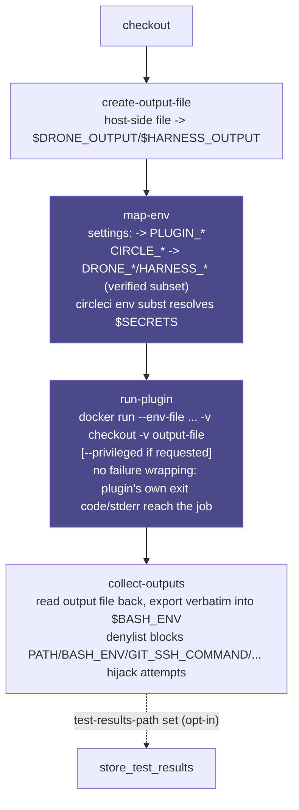

# Architecture

How `harness-orb` executes a plugin, the command pipeline behind `harness/plugin`, and the second,
narrower execution model behind `harness/plugin-native`.

## Table of contents

- [Scope: one plugin per call, not a whole pipeline](#scope-one-plugin-per-call-not-a-whole-pipeline)
- [The docker-run path](#the-docker-run-path)
  - [The four commands](#the-four-commands)
  - [Why `machine`, not `docker` + `setup_remote_docker`](#why-machine-not-docker--setup_remote_docker)
- [The native primary-container path](#the-native-primary-container-path)
  - [Why `entrypoint` is required, with no default](#why-entrypoint-is-required-with-no-default)
  - [Why the primary container's own `entrypoint:`/`command:` keys are not used](#why-the-primary-containers-own-entrypointcommand-keys-are-not-used)
  - [The mandatory preflight](#the-mandatory-preflight)
  - [`attach_workspace` by default, `checkout` as opt-in](#attach_workspace-by-default-checkout-as-opt-in)
  - [Does `map-env` drop in unmodified? Checked, not assumed](#does-map-env-drop-in-unmodified-checked-not-assumed)
  - [A plugin's dependency is a service container; the plugin itself is not](#a-plugins-dependency-is-a-service-container-the-plugin-itself-is-not)

## Scope: one plugin per call, not a whole pipeline

This orb runs **one Harness/Drone Plugin step**, not a whole Harness pipeline or `.drone.yml`. It
is not a Harness-pipeline importer and doesn't touch Harness's own stage/pipeline orchestration,
approvals, or templates. Everything that would normally be a separate stage or step in your old
pipeline (checkout, caching, artifact upload) has a native CircleCI equivalent already
(`checkout`, `save_cache`/`restore_cache`, `store_artifacts`), and this orb expects you to keep
using those directly. See [LIMITS.md](LIMITS.md).

## The docker-run path

### The four commands

A Harness/Drone plugin's entire execution contract is `docker run -e PLUGIN_X=Y image`, confirmed
directly from Harness's own [local-plugin-testing
instructions](https://developer.harness.io/docs/continuous-integration/use-ci/use-drone-plugins/custom_plugins/#test-plugins-locally).
This orb reduces to exactly that, decomposed into four layered commands so a future multi-plugin
chain could reuse pieces of it without a breaking change:

1. **`create-output-file`**: creates the host-side file that becomes the plugin's
   `$DRONE_OUTPUT`/`$HARNESS_OUTPUT`.
2. **`map-env`**: turns your `settings:` block into `PLUGIN_<KEY>` env vars (the case rule is
   verified against real plugin source, not assumed), maps the `CIRCLE_*` vars that have a
   verified `DRONE_*`/`HARNESS_*` equivalent, and resolves `$VAR`/`${VAR}` references at runtime
   via [`circleci env subst`](https://circleci.com/changelog/new-cli-command-env-subst) so secrets
   never sit in orb config. Substitution runs on each settings value only, after the block has
   already been split into individual `key: value` lines, so a substituted secret's value can
   never inject an extra settings line of its own.
3. **`run-plugin`**: the actual `docker run`, bind-mounting your checkout and the output file into
   the container. There is no failure wrapping and no retries: the plugin's own exit code and
   stderr reach the job unchanged. That also means a missing plugin-specific required setting
   (Slack's `webhook`, for example) surfaces as whatever error the vendor's own binary happens to
   print, not an orb-level validation message. Consult the plugin's own README or Marketplace page
   for its required settings; this orb does not know them.
4. **`collect-outputs`**: reads the plugin's output file back and exports every value verbatim,
   under the plugin's own key, into `$BASH_ENV`.

The `plugin` command composes all four; the `plugin` job wraps that command with `checkout` and an
executor.



Every stage is independently callable and cheap to rerun. There is no CLI install step here at all
(unlike the sibling `bitrise` orb), so chaining multiple plugins in one job (see
[GETTING-STARTED.md](GETTING-STARTED.md)) needs no `skip-*` flags: just give each call its own
`output-file`/`env-file` pair. See [ROADMAP.md](ROADMAP.md)'s "Command-split decisions" for why
this is four commands instead of one.

### Why `machine`, not `docker` + `setup_remote_docker`

Plugin containers need a real bind mount of the checkout, and some need `--privileged`. With
`setup_remote_docker`, the job's container and the Docker daemon it talks to are two separate
machines. CircleCI's own docs are explicit that you can't bind-mount there, only `docker cp`. The
`docker` executor and the self-hosted Container Runner also both refuse privileged containers
outright. `machine` sidesteps all of it with a real bind mount and real root, at the cost of the
`docker` executor's per-second billing profile: exactly the tradeoff
[`CircleCI-Labs/act-orb`](https://github.com/CircleCI-Labs/act-orb) already makes for the analogous
GitHub Actions case.

There is deliberately no vendor convenience-image executor here. Every Harness/Drone plugin is
already its own purpose-built image, so `run-plugin` just `docker run`s it directly and there is no
generic Harness base image to layer in. See [ROADMAP.md](ROADMAP.md)'s "Vendor-image layering" for
the full research behind that conclusion.

## The native primary-container path

Everything above runs the plugin with `docker run` from a separate `machine`-executor container.
There is a second, narrower path: give the plugin's own image straight to a `docker` executor as
the job's primary container. CircleCI ignores a primary container's own `ENTRYPOINT`/`CMD` and runs
the job's `steps:` inside the already-live container, so `harness/plugin-native` just execs the
plugin's real entrypoint as an ordinary `run:` step. There is no `docker run`, no bind mount, no
`--privileged`, and no root-owned-file chown fixup afterward.

```yaml
version: 2.1
orbs:
  harness: cci-labs/harness@x.y.z
workflows:
  main:
    jobs:
      - build_workspace # an earlier, ordinary job that checks out and persist_to_workspace's
      - harness/plugin-native:
          requires: [build_workspace]
          image: bitbucketpipelines/git-secrets-scan:3.2.0
          entrypoint: python3 /pipe.py
          workspace-root: /tmp/workspace
```

See [`src/examples/native_plugin_usage.yml`](../src/examples/native_plugin_usage.yml) for a
complete, runnable version, and `.circleci/test-deploy.yml`'s `"Test native primary container..."`
job for this repo's own real CI proof against that exact image. That job proves the
`CIRCLE_*`/workspace half of the chain (`HARNESS_WORKSPACE`/`DRONE_WORKSPACE` correctly set from the
attached workspace) against a real vendor image. It is not a real Harness/Drone plugin, so it never
passes `settings:`, and its `pre-steps` set its own env vars directly, bypassing `map-env-native`
entirely (see that job's own comments). The settings-delivery half (`settings:` through
`map-env-native` to `PLUGIN_<KEY>` reaching the plugin's own process) is proven separately, by
`test_plugin_native_fixture_settings` in the same file, against this repo's credential-free
test-fixture image. See "Does `map-env` drop in unmodified?" below for exactly what that job asserts
and why it exists as its own job rather than being folded into the git-secrets-scan one.

### Why `entrypoint` is required, with no default

A plugin's real entrypoint is vendor-chosen and arbitrary (`/bin/drone-slack`, `/pipe.sh`,
`python3 /pipe.py`), and there is no way to discover it from inside the container: `docker inspect`
needs a Docker daemon, and a `docker`-executor primary container has none. So `entrypoint` has no
default; omitting it is a `circleci config validate` error, not a runtime guess. Find the right
value in the plugin's own Dockerfile or documentation.

### Why the primary container's own `entrypoint:`/`command:` keys are not used

CircleCI jobs also have a job-level `entrypoint:`/`command:` (and a
`com.circleci.preserve-entrypoint` image label) for keeping a primary container's own baked-in
entrypoint alive instead of overriding it. This orb deliberately does not use that mechanism: a
preserved entrypoint starts before this job's own `steps:`, before `checkout`/`attach_workspace`,
before anything, and CircleCI's own docs describe an entrypoint as expected to run forever, the way
a database or proxy sidecar would. A plugin is the opposite of that: it runs once, produces output,
and exits. If a plugin's batch process exits under a preserved entrypoint, the job terminates and no
later step ever runs, silently discarding every step after it: the exact "silently do nothing"
failure mode this family of orbs is built to avoid. Exec'ing the entrypoint as an ordinary `run:`
step (what `run-plugin-native.sh` actually does) sidesteps this entirely. It runs in its own step,
at the point in `steps:` you asked for, and its exit code is that step's exit code like any other.

### The mandatory preflight

`plugin-native` (and the `plugin-native` job) run `preflight-native` first, before
`checkout`/`attach_workspace`, so an ineligible image fails fast with a specific, actionable reason
instead of a confusing break partway through: a `checkout` that dies mid-clone because git is
missing, or a plugin binary that dies on its first HTTPS call because the CA bundle is empty. Every
check is a check of the container's own filesystem and `PATH`. Nothing here talks to a Docker
daemon, because a `docker`-executor primary container doesn't have one.

Checked in this order, refusing at the first failure:

1. **Docker-daemon requirement** (the `plugins/docker` case). Detected by looking for a
   `dockerd`/`dockerd-entrypoint.sh` binary directly on the container's filesystem: a static
   signature, not a live probe, since there is no daemon to probe.

   Honest limitation: this only catches an image that ships its own `dockerd` (exactly
   `plugins/docker`'s case). A plugin that merely shells out to a bare `docker` CLI and assumes some
   externally reachable daemon via a pre-set `$DOCKER_HOST` leaves no such static signature on disk
   and is not reliably detectable from inside the container alone. Needing a live daemon at runtime
   is a behavior, not a file. That case is not caught; it is documented here instead of silently
   mis-claimed as covered.

   > `PREFLIGHT REFUSED (docker-daemon-required): found <path> in this image. This image ships its own dockerd (or a dockerd-entrypoint.sh wrapper) and expects a reachable Docker daemon via $DOCKER_HOST. There is no daemon inside a CircleCI docker-executor primary container, and there never can be without --privileged (which the docker executor refuses). Use the existing machine-executor 'harness/plugin' job (docker run against a real daemon) for this image instead of 'harness/plugin-native'.`
2. **`tar` missing**: `attach_workspace`/`checkout` need it to unpack the workspace archive.
   > `PREFLIGHT REFUSED (missing-tool: tar): 'tar' was not found in this image. attach_workspace (and checkout, if enabled) needs tar in the primary container to unpack the workspace/checkout archive. See https://circleci.com/docs/custom-images/#adding-required-tools-to-a-custom-image`
3. **`gzip` missing**: same rationale, `gzip` instead of `tar`.
4. **No usable CA bundle.** Checks four common bundle paths and requires one to exist and exceed
   1024 bytes. A bundle present but empty or stub is a real, verified case (`plugins/slack`), so
   existence alone isn't enough.
   > `PREFLIGHT REFUSED (missing-ca-certificates): no usable CA certificate bundle was found in this image (checked /etc/ssl/certs/ca-certificates.crt, /etc/ssl/certs/ca-bundle.crt, /etc/pki/tls/certs/ca-bundle.crt, /etc/ssl/cert.pem, each must exist AND be larger than 1024 bytes, since a present-but-empty/stub bundle file is a real case this orb has seen). Without real CA certificates, HTTPS calls this job needs (CircleCI's own API for attach_workspace/persist_to_workspace, and most plugin backends) will fail with certificate-verification errors.`
5. **`git`/`ssh` missing**: only checked when `checkout: true` is requested (the default,
   `checkout: false`, needs neither).
   > `PREFLIGHT REFUSED (missing-tool: git): 'git' was not found in this image, but checkout: true was requested. See https://circleci.com/docs/custom-images/#adding-required-tools-to-a-custom-image, either set checkout: false and rely on attach_workspace instead (this job's default), or use an image that includes git.`

BusyBox `tar`/`gzip` (common on Alpine) is a warning, not a refusal. CircleCI's own guidance
recommends GNU tar/gzip because BusyBox's variants have known incompatibilities that can silently
corrupt `attach_workspace`/`persist_to_workspace` archives; the job still proceeds.

For the sampled-image verification table showing which real images pass or fail each check, and how
that has drifted since the design pass, see [LIMITS.md](LIMITS.md)'s "Preflight verification
drift".

### `attach_workspace` by default, `checkout` as opt-in

`plugin-native`/the `plugin-native` job default `checkout: false` and run `attach_workspace`
instead. Attaching a workspace an earlier, ordinary job (any ordinary `cimg/base`-class executor)
already ran `checkout` in sidesteps the git/ssh/ca-certificates requirement on the plugin's own
image entirely: the plugin's image only ever needs to be tooling-complete enough for
`attach_workspace` (tar, gzip, ca-certificates), a meaningfully lower bar than full `checkout` plus
git and ssh. Set `checkout: true` only for an image you know can support it; `preflight-native`
enforces the stricter tier when you do.

### Does `map-env` drop in unmodified? Checked, not assumed

No. The original `map-env` writes a `docker --env-file` for `run-plugin`'s `docker run --env-file`
to consume; in this model there is no `docker run` to hand an env-file to. Shipping this path with
the original `map-env` (or skipping the question) would have meant the plugin's `settings:` silently
never reaching it at all: the specific "silently half-works" failure mode this family of orbs exists
to avoid. Two things had to change, and both did:

- A new script/command, **`map-env-native`**, reusing the identical `PLUGIN_<KEY>` settings-parsing
  and validation rules and the identical verified `CIRCLE_*` to `DRONE_*`/`HARNESS_*` subset, but
  exporting into `$BASH_ENV` instead of an env-file: the same sink `create-output-file`/
  `collect-outputs` already use, since every later `run:` step (including `run-plugin-native`)
  sources `$BASH_ENV` automatically at start.
- `DRONE_WORKSPACE`/`HARNESS_WORKSPACE` and `DRONE_OUTPUT`/`HARNESS_OUTPUT` point at the real
  host-side paths directly, not a container-side bind-mount path. There is no bind mount, and no
  host/container path duality, to remap.

`create-output-file` and `collect-outputs` drop in completely unmodified. Neither one has any
docker/bind-mount assumption baked in to begin with: `create-output-file` just creates an empty file
at a path, and `collect-outputs` just reads a file back and exports its contents into `$BASH_ENV`.
Whether the plugin wrote to that path via a bind mount or because it's running directly inside the
same container is invisible to both scripts.

This is proven in this repo's own CI, not just asserted here, and it matters which job you point at
for which claim:

- `"Test native primary container - git-secrets-scan against attached workspace"` runs a real vendor
  image (`bitbucketpipelines/git-secrets-scan:3.2.0`) end to end and proves the `CIRCLE_*`/workspace
  half: `HARNESS_WORKSPACE`/`DRONE_WORKSPACE` land correctly from the attached workspace. That image
  is a stand-in pipe, not a real Harness/Drone plugin. It reads its own literal env var names, not
  the `PLUGIN_<KEY>` contract `settings:` produces, so this job's `pre-steps` set its handful of env
  vars directly and never call `map-env-native` with real `settings:` at all. It does not exercise
  the settings half of `map-env-native` and previously got miscited here as if it did.
- `test_plugin_native_fixture_settings` is the job that actually proves the settings half: it runs
  this repo's own credential-free test-fixture plugin image (the same one `test_plugin_command`
  uses to prove the docker-run path's settings delivery) through the real, unmodified chain
  (`preflight-native`, `create-output-file`, `map-env-native`, `run-plugin-native`'s entrypoint-exec,
  `collect-outputs`) with real `settings:` (`message`/`greeting`), and asserts the fixture plugin's
  own output (`GREETING_ECHOED`/`PLUGIN_RESULT`) round-trips back correctly. That's the job to point
  at for "does `map-env-native` actually deliver `settings:` to a real plugin process," not the
  git-secrets-scan one.

Both jobs are real and both stay in CI. They prove different, complementary halves of the same path,
and neither one alone proves the whole thing.

### A plugin's dependency is a service container; the plugin itself is not

If a plugin needs to talk to something (a Redis or Postgres it connects to, not the plugin itself),
that dependency is a legitimate CircleCI [service
container](https://circleci.com/docs/glossary/#service-container), or a plain `docker run -d` in a
step, reached over `--network host` through this orb's existing `additional-docker-flags` (see
[LIMITS.md](LIMITS.md) for what `--network host` costs). This is explicitly the right pattern for a
plugin's dependency, and explicitly the wrong one for the plugin itself: a service container gives
you no way to read its exit code, no way to sequence it as a step among other steps, and no way to
feed it settings computed earlier in the job. `plugin`/`plugin-native` give you all three for the
plugin itself. Nothing in this orb builds or wires up a service container automatically; this is
documentation of an existing, already-general CircleCI mechanism, not a new command.
